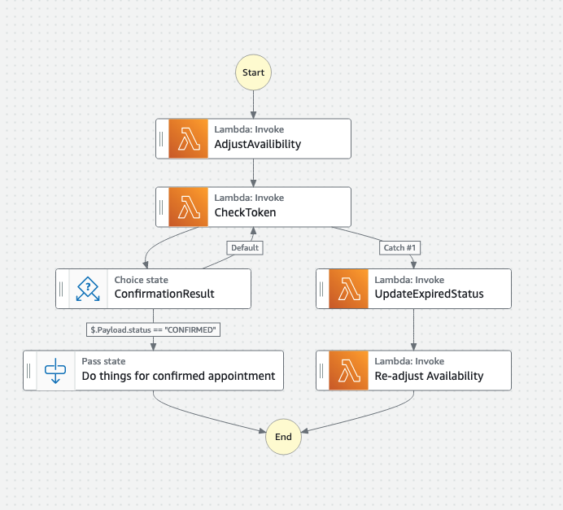

# Appointment Scheduling API

## About the Design

The API consists of 5 routes, 3 DynamoDB tables, and a Step Function. I also included a script that would be used in the Step Function to adjust the availability of the providers when an appointment is scheduled.

## API Endpoints

### Health Check

This endpoint checks the health of the DynamoDB and Step Function services by:
- Scanning an empty DynamoDB table to verify the service is up.
- Listing executions of the Step Function to ensure the state machine service is functioning.

### Post Provider Availability

This endpoint allows providers to submit their availability for appointments. It:
- Fetches current availability.
- Updates the availability dictionary with new slots.
- Saves the updated availability in DynamoDB.

### Reserve an Appointment

This endpoint allows clients to reserve an available appointment slot. Key details:
- Reservations must be made at least 24 hours in advance.
- Checks if the slot is available.
- Initiates the Step Function state machine.
- Stores the reservation in DynamoDB.

### Update Appointment Status

This endpoint allows the status of an appointment to be updated to "DENIED", "EXPIRED", or "CONFIRMED". It:
- Validates the status.
- Updates the status in DynamoDB.
- Sends task success to the Step Function if the status is "CONFIRMED".

## DynamoDB Tables

### Availability Table

Stores the availability of providers.

#### Schema
- **provider_id** (Partition Key)
- **availability_date** (Sort Key)
- **available_slots**: Dictionary of available start times and corresponding end times.

### Appointment Table

Stores the appointments made by clients.

#### Schema
- **provider_id** (Partition Key)
- **appointment_id** (Sort Key)
- **date**: Date of the appointment.
- **start_time**: Start time of the appointment.
- **status**: Status of the appointment ("PENDING", "DENIED", "EXPIRED", "CONFIRMED").

### Health Checks Table

Used for health checks to verify DynamoDB service availability.

## Step Function

The Step Function handles the reservation process, including waiting for confirmation and updating the status of appointments.

  

### Definition

- **CheckToken**: Waits for a task token to be updated.
- **ConfirmationResult**: Checks the status returned by the Lambda function.
- **AdjustAvailability**: Adjusts the availability after confirmation.
- **UpdateExpiredStatus**: Updates the status to "EXPIRED" if the token is not updated within the timeout period.

## AWS Step Function Integration

The Step Function handles:
- Checking for task token updates.
- Waiting for confirmation.
- Adjusting availability to include/exclued 15 minute increments
- Updating the status to "EXPIRED" if no confirmation is received within the timeout period.

## GCP Equivalents

- **Data Storage**: Instead of using DynamoDB, the GCP equivalent would be **Google Cloud Bigtable**.
  
- **Workflow Management**: Instead of Step Functions, a **GCP Workflow** can be used.

### GCP Workflow Features

- **Pause the Workflow**: Use the `wait_for` step to pause the workflow execution until a specific HTTP callback is received.

- **External Process Completes**: Have the external process call back the workflow using a predefined URL endpoint to notify that the process is complete.

- **Resume the Workflow**: Once the callback is received, the workflow continues execution from the paused state.

## Other considerations
- I would add unit test coverage throughout. The routes wouldn't be hard to get 100% coverage on and would give me more piece of mind.
- It would be worth considering going multiregional to allow for redundancy in the system. If the cloud provider goes out in one region it wouldn't be great to be stuck in that region.
- I would use some sort of infrastructure as code. I prefer Terraform but Pulumi is another good option. 